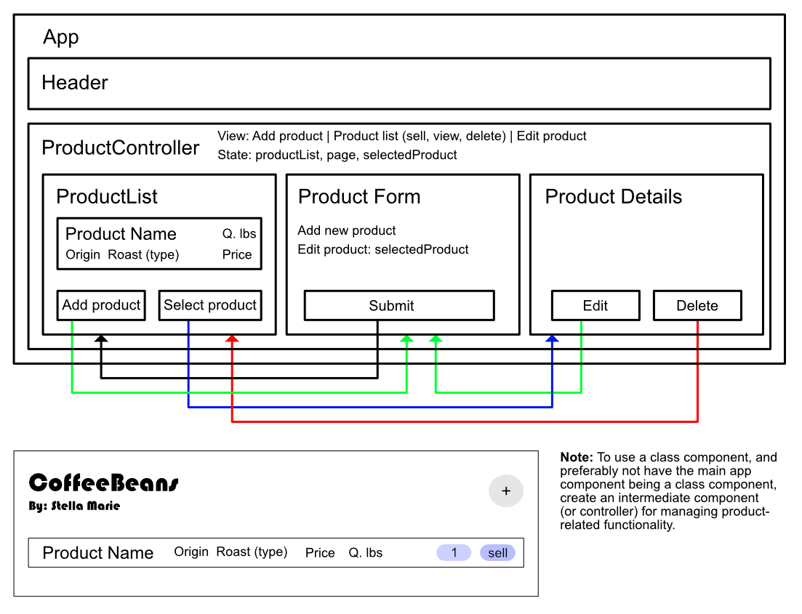

# Inventory Tracker

By: Stella Marie

## Technologies Used

- React
  - prop types
  - uuid
- Scaffolded with Vite

## Description

Inventory Tracker is a React app for managing the inventory of a coffee beans vendor. Coffee beans are assumed to come in burlap sacks of 130 lbs, sold by the pound.

**Prompt Requirements:**
- List of all available products
- Item: name, origin, price, roast, amount remaining
- Submit form to add new item
- Click on product to see details
- Click button: sell a pound
- Number of pounds of a sack cannot go below 0

**Project Requirements:**
- CRU(D) functionality
- Use of a class component and a functional component
- Use of local and shared state
- PropTypes

**Consideration:**
- Edit item properties
- Delete an item
- Item status (out of stock == 0, almost empty < 10)

### App Layout



**App**
- ProductList
  - Product -> [selectProduct] ProductDetails
  - Sell product [sellProduct]
  - Add product [goToAdd] -> AddProductForm
- ProductDetails
  - Sell product [sellProduct]
  - Edit product [goToEdit] -> EditProductForm
  - Delete product -> [deleteProduct] ProductList
  - Return [goToList] -> ProductList
- AddProductForm
  - [submit] -> [addProduct] ProductList
- EditProductForm
  - [submit] -> [editProduct] ProductList

## Complete Setup

This project will not be accepting pull requests, but you may fork the project for your own use.

- Fork or clone project
- Run ```npm i``` to install dependencies
- Run ```npm run preview```

If project does not open in a browser, there will be a link in the terminal: Ctrl + Click

To keep your forked repo up to date with any updates I make to the repo, use: 

```bash
git remote add upstream repo_url.git
```

If you find that you need to remove the upstream, use:

```bash
git remote rm upstream
```

However, I suggest checking that there is an upstream first with:

```bash
git remote -v
```

## Known Bugs

- Inconsistent styling (use Tailwind and/or Styled Components)

## License

[MIT](https://choosealicense.com/licenses/mit/)

Copyright © 2023 SmKou